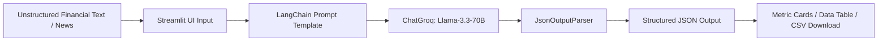

# 📈 FinExtract AI - Financial Data Extractor

[](https://www.python.org/)
[](https://streamlit.io/)
[](https://www.langchain.com/)
[](https://groq.com/)

**FinExtract AI** is an intelligent, LLM-powered financial news and earnings report analysis application. It automatically extracts key performance metrics—such as **Actual Revenue**, **Expected Revenue**, **Actual EPS**, and **Expected EPS**—from unstructured news articles, quarterly press releases, and earnings reports.

---

## 🌟 Key Features

- ⚡ **LLM-Driven Extraction**: Powered by **Groq AI** using the state-of-the-art `llama-3.3-70b-versatile` model via **LangChain**.
- 📊 **Metric Comparison**: Displays Actual vs. Expected metrics in high-visibility financial cards.
- 📋 **Structured Data Table & Raw JSON**: View extracted metrics formatted as clean dataframes or raw structured JSON.
- 📥 **CSV Export**: Download extracted metrics directly as a CSV file for further quantitative analysis.
- 🎯 **Preset Sample Reports**: Built-in test samples for top companies like **Tesla**, **Apple**, and **NVIDIA** for quick demonstration.
- 🔑 **Flexible API Authentication**: Input API keys directly via the Streamlit UI sidebar, `.env` file, or Streamlit Secrets.
- 🎨 **Modern Dark UI**: Designed with custom CSS styling inspired by modern financial analytics dashboards.

---

## 🏗️ Architecture & Workflow



---

## 📁 Repository Structure

```
finance-data_extractor/
├── main.py                # Main Streamlit dashboard application & UI layout
├── data_extractor.py      # Core extraction logic using LangChain & Groq API
├── gradient.py            # Utility / Demo script for linear regression gradient descent
├── requirements.txt       # Project dependencies
├── .env                   # Environment variables (API Key storage)
└── README.md              # Project documentation
```

---

## 🚀 Getting Started

### Prerequisites

- **Python 3.8+** installed on your system.
- A **Groq API Key** (Get one for free at [console.groq.com](https://console.groq.com/)).

### 1. Clone the Repository

```bash
git clone https://github.com/Sai2475/financial_data_extractor.git
cd financial_data_extractor
```

### 2. Create and Activate a Virtual Environment

**Windows:**
```bash
python -m venv venv
venv\Scripts\activate
```

**macOS / Linux:**
```bash
python3 -m venv venv
source venv/bin/activate
```

### 3. Install Dependencies

```bash
pip install -r requirements.txt
```

---

## 🔑 Environment Configuration

Create a `.env` file in the project root directory (or edit the existing one):

```env
GROQ_API_KEY=your_groq_api_key_here
```

*(Note: If you don't set the key in `.env`, you can also enter it manually in the application sidebar or configure it in `.streamlit/secrets.toml`.)*

---

## 💻 Running the Application

Launch the Streamlit dashboard by running:

```bash
streamlit run main.py
```

The application will automatically open in your default browser at `http://localhost:8501`.

---

## 📖 Usage Guide

1. **Launch App**: Start the app via `streamlit run main.py`.
2. **Set API Key (Optional)**: If not saved in `.env`, paste your Groq API key into the sidebar text field.
3. **Input Article**: 
   - Click one of the sample buttons (`Tesla Q3`, `Apple Q4`, `NVIDIA Q2`) to auto-populate a financial earnings paragraph.
   - Or paste custom news text/press release directly into the text area.
4. **Extract Data**: Click **⚡ Extract Data**.
5. **View Results**:
   - Inspect metric cards showing Revenue and EPS (Actual vs Consensus).
   - Switch between **Structured Data Table** and **Raw JSON Output** tabs.
   - Click **📥 Download Results as CSV** to save extracted data locally.

---

## 🛠️ Built With

- **[Streamlit](https://streamlit.io/)** - Web Framework & Dashboard
- **[LangChain](https://www.langchain.com/)** - LLM Orchestration & Output Parsing
- **[Groq AI](https://groq.com/)** - High-speed Llama-3.3-70B LLM Inference
- **[Pandas](https://pandas.pydata.org/)** - Data manipulation & tabular formatting

---

## 📄 License

This project is open source and available under the [MIT License](LICENSE).